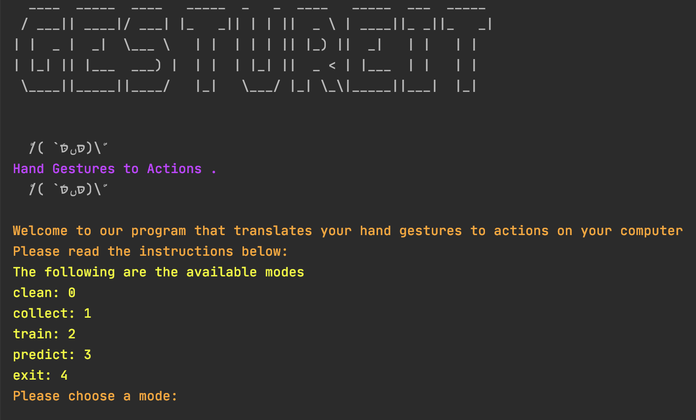
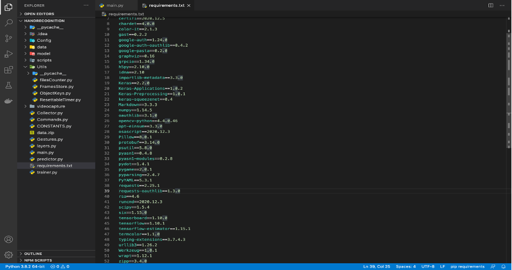
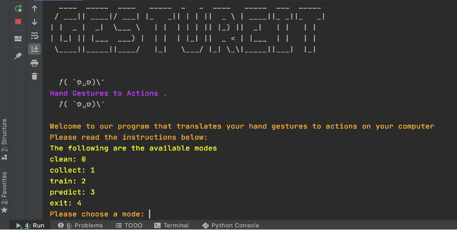
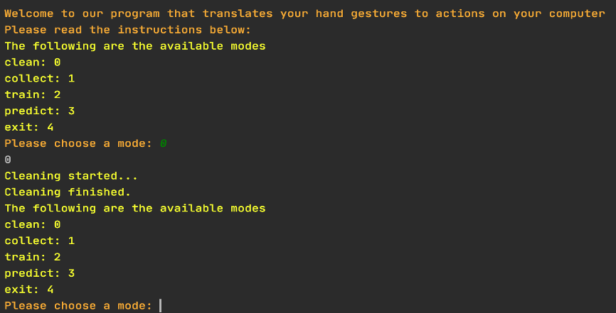
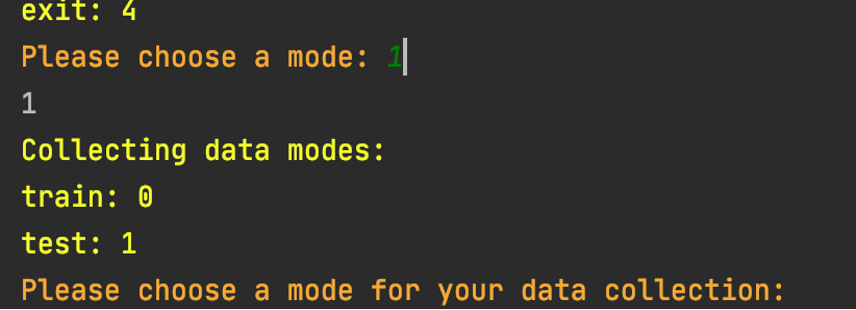

# Gestureit

# **Overview**

**Gestureit is an application that converts your gestures to actions excuted on your Computer.**

  

Topics Covered in this Implementation:

Artificial Intelligence, Computer Vision, Deep Learning, and Neural Networks.

Contributors: Soufiane KARROUMI &amp; Omar LAHKIM

# Motivation

Have you ever wished to stop, move forward or backward a movie playing on your laptop remotely while laying on your bed without the burden of going to your computer and do it yourself? Or simply remotely shut down your laptop when you&#39;re leaving your place? How about you being able to customize and map different hand gestures to different computer commands? So, Then When a gesture is recognized it gets translated to a command done by the computer whether it&#39;s lowering, increasing volume, accept a video call…etc.

Our project will be focusing mainly on using Computer Vision in Artificial Intelligence to identify Human hand gestures and turn them into computer commands with some reliance on Machine Learning.

# Application description

This project covers two specific areas of Artificial intelligence which are Machine Learning (Deep Learning) and Computer Vision, the major technology we have relied on while working on it is Artificial Neural Networks and more precisely Convolutional Neural Networks. we have developed a program that made it possible to have the computer identifies the different hand gestures that get shown to its camera and execute the correspond command that is mapped to that gesture, a simple example could be running the program and have your hand represent the number 0, 1 or the punch symbol or any other gesture and the program will know which command to execute whether increase the volume, play a Spotify song, shut down the laptop and so on and so forth. These commands and gestures can be added, removed, remapped dynamically in our program. If we want to summarize our program into major steps, we can safely say it is composed of 4 major steps:

1. Defining the Classification Categories: at first, we need to define our classification categories, these are the output labels of the neural network, more concretely, they represent the set of the gestures we want to map the commands to.
2. Collecting Training and Testing Data: multiple libraries were used at this point, among them Keras implementation of TensorFlow
3. Training The model:
4. Running the final program with the trained model

For the design choices, Python was our programming language of choice since we are used to working on AI projects with it, also the Assignment 2 was done using Python. For the code itself, computer vision-related work, that is activating camera, taking input images and storing them for doing training and testing was done with the help of OpenCV library. For the learning model, as specified earlier, we worked with Convolutional Neural networks since they are mainly focused on Image recognition, at a lower level, we have decided to work with ReLU activation function in the hidden layers and Softmax in the activation layer of the output layer, Adam as the optimizer and categorical cross entropy loss function since we&#39;re doing multi-class classification.

# Code description

The code is organized around classes, we have multiple classes to serve multiple non-functional or functional requirements, the first class is the one which is responsible for handling anything video related [videcapture.py], it is a custom wrapper that we implemented on top of OpenCV to abstract image and video processing.

- Class [Gestures.py] manipulates data stored in a json file &#39;Gestures.json&#39;; get gesture names, rename gestures.

- [Commands.py] is the same as Gestures.py in terms of manipulation except that Commands.py is responsible for manipulating commands, and mapping gestures to their correspondent commands.

- [ResettableTimer.py]: in this class we implemented a custom version of timer provided by python, the utility of this timer is that during the execution of the program, as soon as the camera detects a gesture with a potential command, the timer starts the count, and after 45seconds of maintaining the same hand gesture, the correspondent command executes, and the timer resets its value to 0 in order to start the count for the next gesture.

- [FramesStore.py]: contains 2 classes, the first one is Frame; this class is a wrapper of the frame implementation provided by OpenCV that we created in order to simplify and make it easy to work with frames later o. The second class is FramesStore: custom implementation to store and get access to already existing frames data.

- [Collector.py]: organizes and handles training and testing images hierarchy in the &quot;data&quot; directory and create the directory if not existent, a major functionality of this class is when running the program, the storing of images happens thanks to one of its functions which is &quot;keyToImage&quot;

- [Trainer.py]: This is the most important class when it comes to the backend of our application, here we designed the model of the CNN, this means setting the layers, filters, choosing the loss function, which in our case is the categorical cross entropy, choosing the optimizer (Adam) and the learning rate(lr=0.001). some other variables like epochs (how many times the model have to redo the training over all the dataset)

- [Predictor.py]: returns the predicted value by relying on to parameters: the hand gesture detected on the frame and the model result of the prediction

Note: another detailed code description is found as comments in the code

# Conclusion and future work

The major challenge that was faced while working on this project is coming up with the best model possible, we observed during training and testing that we get different accuracy results based on different models and our goal for the big portion of this project is having a model with a very reliable optimizer to decrease the loss rates and therefore have near-perfect filters. However, we still want to work on this project later on when time is right, we will try to instead of working with just one hand, have the program identify gestures in 2 hands, this will give possibility to map way more gesture to actions. Another future improvement in the usability of this program is having the program detect the hands no matter where they are placed in front of the camera instead of being obliged to place them in a fixed frame.2

# User Manual

Note: this is only compatible with macOS because have used AppleScript for action executions.

This project is done using Python version 3.6: the requirements to run it are specified in &quot;requirements.txt&quot;

  

In order to install them, you only need to run one command inside the directory which is &quot;pip3 install -r requirements.txt&quot;, if it doesn&#39;t work, try is &quot;pip install -r requirements.txt&quot;

Now that you have all packages and dependencies installed, run &quot;main.py&quot; 

  

This is the entry point of the program; the user is asked to choose between 4 options

- Clean: erase all the testing and training data with the trained model on them, when this choice is performed, user will have to do data collection (1) of both training and testing, and run the training (2) afterwards 

  

- Collect: collect testing or training data

  

This is the case of collecting training data (as you can see, we already have 224 images of the ZERO gesture, 249 images of ONE gesture, 262 images of the PUNCH gesture…)

- an example of how to save an image as a gesture is this: if you want to save a hand sign for the ZERO gesture, you symbolize 0 with your hand and you press &quot;0&quot; on your keyboard and it gets added, if you want to do the same for the PUNCH gesture you do the punch symbol sign with your hand and press &quot;3&quot; on the keyboard.

This figure illustrates the mapping of the gestures to keyboard buttons that should be pressed to save them.

This file on the other hand maps the gestures to their commands

- Train: launch the training of the model to see how well it works on already labeled data to adjust its loss and improve accuracy. We have specified a default value of &quot;epochs = 10&quot;, lower values can be chosen but the greater the value the accurate the model gets since it&#39;ll run more times on the data.

(6 classes represent the 5 hand gestures we have specified)

Model performance at the entry of the 6th epoch

- Predict: launch the camera, detect user input gestures and execute the correspondent command

As you can see, the product is detecting the gesture as the number 1 and on the right-hand side its correspondent command which in this case increasing the volume, after 5 seconds of keeping the same gesture, volume level will increase

- Exit: speaks for itself, stops the program&#39;s execution

# Work distribution

We are a team of 2 students (Soufiane KARROUMI and Omar LAHKIM), we are used to working together and the way we handled this project is the following:

Soufiane had already taken a data mining class in which he studied supervised and unsupervised learning and especially Artificial Neural Networks which constitutes the basis of this project and so he had the required background to start working on the project, but since the domain of application in the context of this project is image recognition, more precisely gestures recognition, ANN was full of shortcomings in this area, the answer was Convolutional Neural Network [CNN], Soufiane had to understand the theoretical workarounds of this ANN variant; what are the convolution layers, filters, pooling and everything related to CNN which was then explained to Omar LAHKIM who is extremely talented in mapping what Soufiane explains to him into a working code. The actual code was written for the most part by Omar with the constant presence of Soufiane thanks to screen sharing, however, decisions on design, some code changes and implementations was done after long discussions. Code testing and major part of the documentation is handled by Soufiane while Omar took care of doing the Demonstration, code enhancing and looking for future works of this application area.

# Sources

Forrest N. Iandola1, Song Han2, Matthew W. Moskewicz1, Khalid Ashraf1, William J. Dally2, Kurt Keutzer1. (2017). Squeezenet: Alexnet-level accuracy with 50x fewer parameters and \&lt;0.5mb model size

[https://openreview.net/pdf?id=S1xh5sYgx](https://openreview.net/pdf?id=S1xh5sYgx)

Ujjwalkarn. (2016). An intuitive explanation of convolutional neural networks

[https://ujjwalkarn.me/2016/08/11/intuitive-explanation-convnets/](https://ujjwalkarn.me/2016/08/11/intuitive-explanation-convnets/)

Deshpande, Adit. (2016). A Beginner&#39;s guide to understanding convolutional neural networks

[https://adeshpande3.github.io/A-Beginner%27s-Guide-To-Understanding-Convolutional-Neural-Networks/](https://adeshpande3.github.io/A-Beginner%27s-Guide-To-Understanding-Convolutional-Neural-Networks/)

Brownlee, Jason. (2019). How do convolutional layers work in deep learning neural networks?

[https://machinelearningmastery.com/convolutional-layers-for-deep-learning-neural-networks/](https://machinelearningmastery.com/convolutional-layers-for-deep-learning-neural-networks/)

Sahab, Sumit. (2018). A comprehensive guide to convolutional neural networks

[https://towardsdatascience.com/a-comprehensive-guide-to-convolutional-neural-networks-the-eli5-way-3bd2b1164a53](https://towardsdatascience.com/a-comprehensive-guide-to-convolutional-neural-networks-the-eli5-way-3bd2b1164a53)

Bhattacharjee, Arindom. (2020). Gesture recognition for beginners with cnn

[https://towardsdatascience.com/artificial-neural-networks-for-gesture-recognition-for-beginners-7066b7d771b5](https://towardsdatascience.com/artificial-neural-networks-for-gesture-recognition-for-beginners-7066b7d771b5)

Data Mining Class Handouts from previous semester